```{r setup, include=FALSE}
knitr::opts_chunk$set(echo = TRUE)
```

## Soil analysis 

### First, we loaded the R packages we need and the raw data of soil samples.

```{r warning=FALSE, include=FALSE, message=FALSE}
library(tidyverse) # Manipulação e análise dos dados
library(vegan) # Análise multivariada e transformações
library(ggfortify) # Criar o gráfico da PCA
library(patchwork) # Plotar gráficos lado a lado
library(gganimate)
library(gifski)
library(transformr)

solo <- read_csv("/home/mcure/Downloads/1_soil - Table_1_standardized.csv")
```

### We changed soil variables' classes to allow transformations and analysis. The profile is a variable that indicates from which depth soil samples were taken and it was defined as a factor. Plot and vegetation type are also factors, but we did not used it to perform the PCA. Thus we excluded variables not used.

```{r}
# Faz as transformações necessárias nas classes
solo$profile <- solo$profile %>% as.factor
solo$`pH(H2O)` <- solo$`pH(H2O)` %>% as.numeric
solo$`C(g/kg)`<- solo$`C(g/kg)` %>% as.numeric
solo$`N(g/kg)` <- solo$`N(g/kg)` %>% as.numeric
solo$`Al(cmolc/dm³)` <- solo$`Al(cmolc/dm³)` %>% as.numeric
solo$`B(mg/dm3)`<- solo$`B(mg/dm3)` %>% as.numeric
solo$`total_CTC(cmolc/dm³)` <- solo$`total_CTC(cmolc/dm³)` %>% as.numeric
solo$`effective_CTC(cmolc/dm³)` <- solo$`effective_CTC(cmolc/dm³)` %>% as.numeric

# Seleciona as colunas que interessam
soil <- solo %>% dplyr::select(-c(4,5,6,7,8)) # Sem a granulometria

```

## Data exploration:

### Soil granulometry.

```{r, include=FALSE}
areia <- solo %>%
  ggplot(aes(x = factor(vegetation_type),
             y = `sand(g/kg)`,
             color = factor(vegetation_type)))+
  geom_boxplot(show.legend = F)+
  ylab("Sand (g/kg)")+
  xlab(NULL)+
  theme(axis.text = element_blank())+
  transition_states(states = profile)+
                      labs(title = "Profile: {closest_state}")

#animate(areia, renderer = gifski_renderer())

#anim_save("areia.gif")

areia_fina <- solo %>%
  ggplot(aes(x = factor(vegetation_type),
             y = `thin_sand(g/kg)`,
             color = factor(vegetation_type)))+
  geom_boxplot(show.legend = F)+
  ylab("Thin Sand (g/kg)")+
  xlab(NULL)+
  theme(axis.text = element_blank())+
  transition_states(states = profile)+
                      labs(title = "Profile: {closest_state}")

#animate(areia_fina, renderer = gifski_renderer())
#anim_save("areia_fina.gif")

silte <- solo %>%
  ggplot(aes(x = factor(vegetation_type),
             y = `silt(g/kg)`,
             color = factor(vegetation_type)))+
  geom_boxplot(show.legend = F)+
  ylab("Silt (g/kg)")+
  xlab("Vegetation type")+
  transition_states(states = profile)+
                      labs(title = "Profile: {closest_state}")

#animate(silte, renderer = gifski_renderer())

#anim_save("silte.gif")

argila <- solo %>%
  ggplot(aes(x = factor(vegetation_type),
             color = factor(vegetation_type),
             y = `clay(g/kg)`))+
  geom_boxplot(show.legend = F)+
  ylab("Clay (g/kg)")+
  xlab("Vegetation type")+
  transition_states(states = profile)+
                      labs(title = "Profile: {closest_state}")

#animate(argila, renderer = gifski_renderer())

#anim_save("argila.gif")
```


### Forests and savannas have distinct soil granulometry. Forests have thin particles of soil and savannas have more coarse granules.


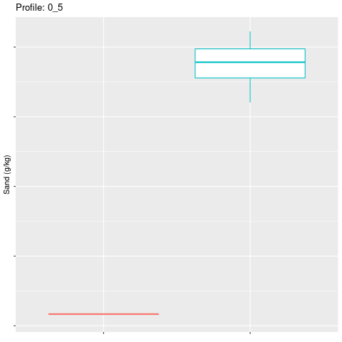
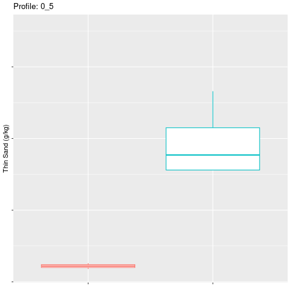

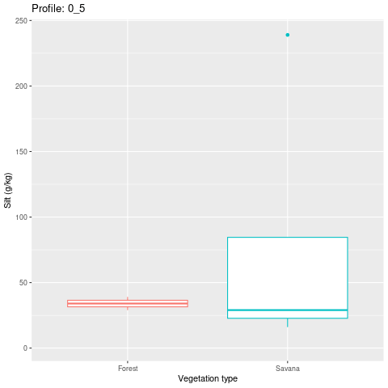

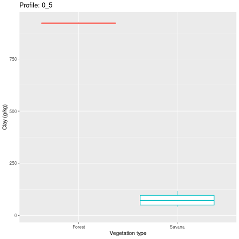

```{r echo=FALSE, include=FALSE}
#(areia+ggtitle("a")|areia_fina+ggtitle("b"))/(silte+ggtitle("c")|argila+ggtitle("d"))
```

## Soil variables: differences among sample plots

```{r, include=FALSE, warning=FALSE, message=FALSE}
ph <- solo %>% ggplot(aes(x = factor(vegetation_type), y = `pH(H2O)`, color = factor(vegetation_type)))+
  geom_boxplot(show.legend = F)+
  ylab("pH (H2O)")+
  xlab("Vegetation type")+
  theme(axis.text.x = element_text(size=11))+
  transition_states(states = profile)+
  labs(title = "Profile: {closest_state}")

# animate(ph, renderer = gifski_renderer())
# 
# anim_save("ph.gif")

BS <- solo %>% ggplot(aes(x = factor(vegetation_type), y = `base_sum(cmolc/dm³)`, color = factor(vegetation_type)))+
  geom_boxplot(show.legend = F)+
  ylab("Base sum (cmolc/dm³)")+
  xlab(NULL)+
  theme(axis.text.x = element_text(size=11))+
  transition_states(states = profile)+
  labs(title = "Profile: {closest_state}")

# animate(BS, renderer = gifski_renderer())
# 
# anim_save("BS.gif")

CTC <- solo %>% ggplot(aes(x = factor(vegetation_type), y = `effective_CTC(cmolc/dm³)`, color = factor(vegetation_type)))+
  geom_boxplot(show.legend = F)+
  ylab("Effective CTC (cmolc/dm³)")+
  xlab("Vegetation type")+
  theme(axis.text.x = element_text(size = 11))+
  transition_states(states = profile)+
  labs(title = "Profile: {closest_state}")

# animate(CTC, renderer = gifski_renderer())
# 
# anim_save("CTC.gif")


S_Al <- solo %>% ggplot(aes(x = factor(vegetation_type), y = `satured_Al(%)`, color = factor(vegetation_type)))+
  geom_boxplot(show.legend = F)+
  ylab("satured_Al(%)")+
  xlab(NULL)+
  theme(axis.text.x = element_text(size = 11))+
  transition_states(states = profile)+
  labs(title = "Profile: {closest_state}")

# animate(S_Al, renderer = gifski_renderer())
# 
# anim_save("S_Al.gif")


C <- solo %>% ggplot(aes(x = factor(vegetation_type), y = `C(g/kg)`, color = factor(vegetation_type)))+
  geom_boxplot(show.legend = F)+
  ylab("C (g/kg)")+
  xlab(NULL)+
  theme(axis.text.x = element_text(size = 11))+
  transition_states(states = profile)+
  labs(title = "Profile: {closest_state}")

# animate(C, renderer = gifski_renderer())
# 
# anim_save("C.gif")


P <- solo %>% ggplot(aes(x = factor(vegetation_type), y = `P(mg/dm³)`, color = factor(vegetation_type)))+
  geom_boxplot(show.legend = F)+
  ylab("P (mg/dm³)")+
  xlab(NULL)+
  theme(axis.text.x = element_text(size = 11))+
  transition_states(states = profile)+
  labs(title = "Profile: {closest_state}")

# animate(P, renderer = gifski_renderer())
# 
# anim_save("P.gif")


N <- solo %>% ggplot(aes(x = factor(vegetation_type), y = `N(g/kg)`, color = factor(vegetation_type)))+
  geom_boxplot(show.legend = F)+
  ylab("N (g/kg)")+
  xlab(NULL)+
  theme(axis.text.x = element_text(size = 11))+
  transition_states(states = profile)+
  labs(title = "Profile: {closest_state}")

# animate(N, renderer = gifski_renderer())
# 
# anim_save("N.gif")

Fe <- solo %>% ggplot(aes(x = factor(vegetation_type), y = `Fe(mg/dm3)`, color = factor(vegetation_type)))+
  geom_boxplot(show.legend = F)+
  ylab("Fe (mg/dm3)")+
  xlab(NULL)+
  theme(axis.text.x = element_text(size = 11))+
  transition_states(states = profile)+
  labs(title = "Profile: {closest_state}")

# animate(Fe, renderer = gifski_renderer())
# 
# anim_save("Fe.gif")

Mn <- solo %>% ggplot(aes(x = factor(vegetation_type), y = `Mn(mg/dm3)`, color = factor(vegetation_type)))+
  geom_boxplot(show.legend = F)+
  ylab("Mn (mg/dm3)")+
  xlab(NULL)+
  theme(axis.text.x = element_text(size = 11))+
  transition_states(states = profile)+
  labs(title = "Profile: {closest_state}")

# animate(Mn, renderer = gifski_renderer())
#
# anim_save("Mn.gif")


Cu <- solo %>% ggplot(aes(x = factor(vegetation_type), y = `Cu(mg/dm3)`, color = factor(vegetation_type)))+
  geom_boxplot(show.legend = F)+
  ylab("Cu (mg/dm3)")+
  xlab(NULL)+
  theme(axis.text.x = element_text(size = 11))+
  transition_states(states = profile)+
  labs(title = "Profile: {closest_state}")

# animate(Cu, renderer = gifski_renderer())
# 
# anim_save("Cu.gif")

K <- solo %>% ggplot(aes(x = factor(vegetation_type), y = `K(mg/dm³)`, color = factor(vegetation_type)))+
  geom_boxplot(show.legend = F)+
  ylab("K (mg/dm³)")+
  xlab("Vegetation type")+
  theme(axis.text.x = element_text(size = 11))+
  transition_states(states = profile)+
  labs(title = "Profile: {closest_state}")

# animate(K, renderer = gifski_renderer())
# 
# anim_save("K.gif")


Na <- solo %>% ggplot(aes(x = factor(vegetation_type), y = `Na(mg/dm³)`, color = factor(vegetation_type)))+
  geom_boxplot(show.legend = F)+
  ylab("Na (mg/dm³)")+
  xlab("Vegetation type")+
  theme(axis.text.x = element_text(size = 11))+
  transition_states(states = profile)+
  labs(title = "Profile: {closest_state}")

# animate(Na, renderer = gifski_renderer())
# 
# anim_save("Na.gif")


Ca <- solo %>% ggplot(aes(x = factor(vegetation_type), y = `Ca(cmolc/dm³)`, color = factor(vegetation_type)))+
  geom_boxplot(show.legend = F)+
  ylab("Ca (cmolc/dm³)")+
  xlab("Vegetation type") +
  theme(axis.text.x = element_text(size = 11))+
  transition_states(states = profile)+
  labs(title = "Profile: {closest_state}")

# animate(Ca, renderer = gifski_renderer())
# 
# anim_save("Ca.gif")


```

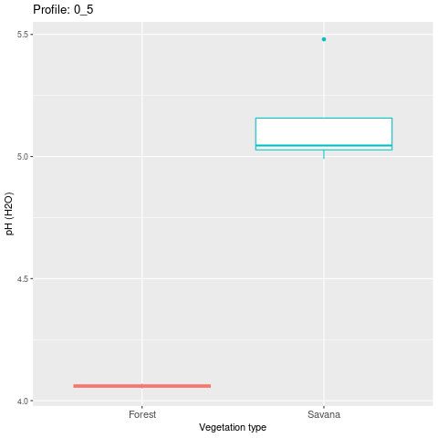
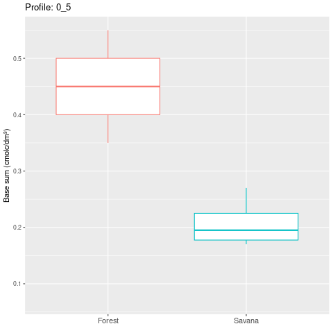

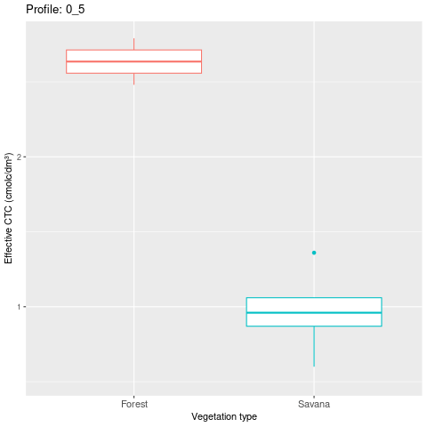

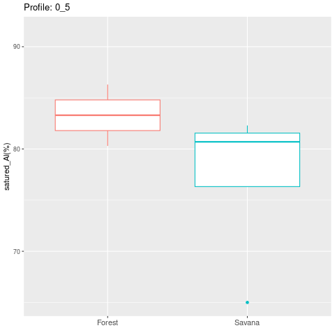
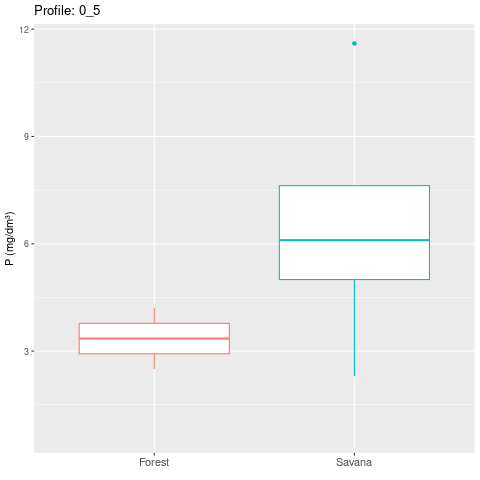

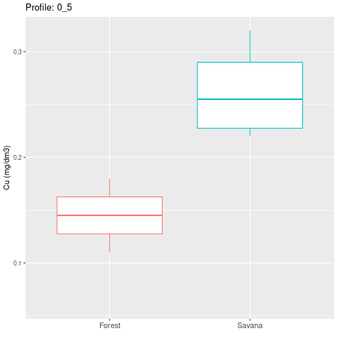

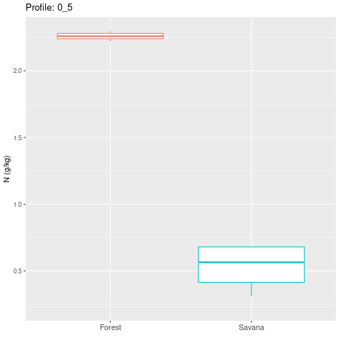
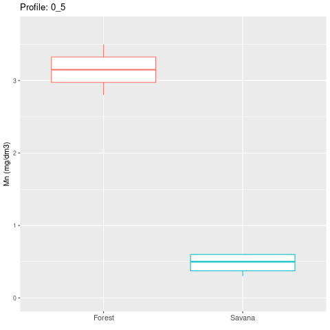

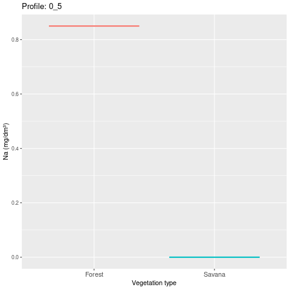
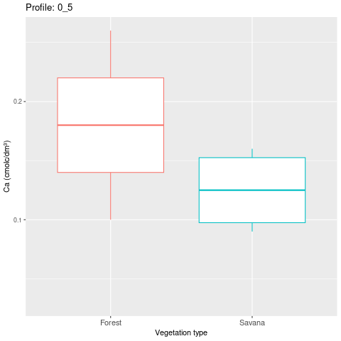

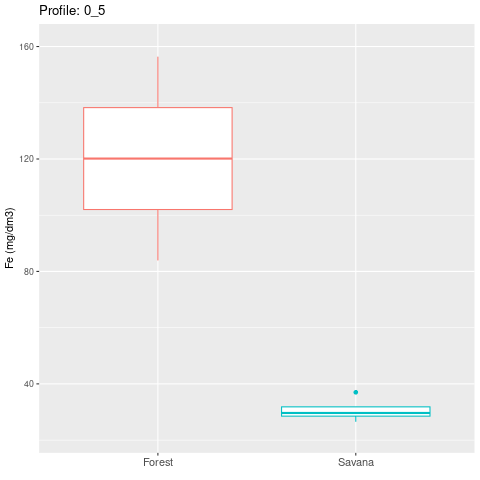

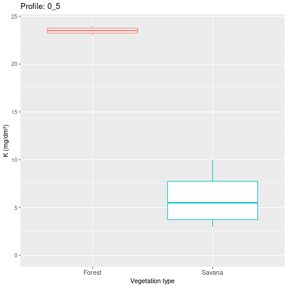

## Correlation among variables

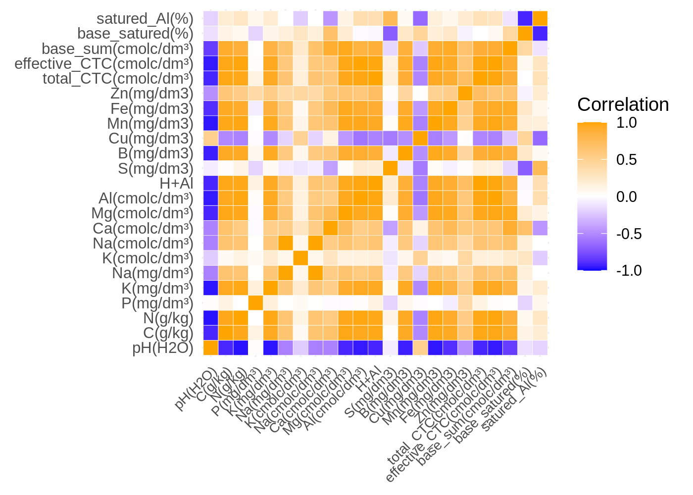

## Data preparation

### We used data from the surface layers (0 to 20 cm).

```{r message=FALSE, warning=FALSE}
solo <- soil %>%
  filter(profile == "0_5" | profile == "10_20") %>%
  group_by(plot, vegetation_type) %>% 
  summarise(`C(g/kg)` = sum(`C(g/kg)`),
            `pH(H2O)` = mean(`pH(H2O)`),
            `N(g/kg)` = sum(`N(g/kg)`),
            `P(mg/dm³)` = sum(`P(mg/dm³)`),
            `Na(mg/dm³)` = sum(`Na(mg/dm³)`),
            `K(mg/dm³)` = sum(`K(mg/dm³)`),
            `Ca(cmolc/dm³)` = sum(`Ca(cmolc/dm³)`),
            `Mg(cmolc/dm³)` = sum(`Mg(cmolc/dm³)`),
            `Al(cmolc/dm³)` = sum(`Al(cmolc/dm³)`),
            `S(mg/dm3)` = sum(`S(mg/dm3)`),
            `B(mg/dm3)` = sum(`B(mg/dm3)`),
            `Cu(mg/dm3)` = sum(`Cu(mg/dm3)`),
            `Mn(mg/dm3)` = sum(`Mn(mg/dm3)`),
            `Fe(mg/dm3)` = sum(`Fe(mg/dm3)`),
            `Zn(mg/dm3)` = sum(`Zn(mg/dm3)`),
            `total_CTC(cmolc/dm³)` = sum(`total_CTC(cmolc/dm³)`),
            `effective_CTC(cmolc/dm³)` = sum(`effective_CTC(cmolc/dm³)`),
            `base_sum(cmolc/dm³)` = sum(`base_sum(cmolc/dm³)`),
            `base_satured(%)` = sum(`base_satured(%)`),
            `satured_Al(%)` = sum(`satured_Al(%)`))

```

### We centralized and standardized data to perform the PCA.

```{r}
soil_scaled <- scale(solo[,-c(1,2)])
```

## PCA

### We performed a Principal Component Analysis to reduce the multidimensional data into two axis. The first two principal components explain 90.07% of the variance in soil variables. 

```{r}
soil_pca <- prcomp(soil_scaled, center = TRUE, scale. = TRUE)

summary(soil_pca)
```

## We created a data.frame with the loadings and ordered the variables according to its importance.

```{r para_o_eixo_1}
loadings <- soil_pca$rotation[,1] %>%
  sort %>% 
  as.data.frame %>%
  rownames_to_column %>%
  rename(loadings = ".") %>% 
  rename(var = "rowname")

loadings$var <- factor(loadings$var, levels = c(loadings$var))
```

```{r}
loadings2 <- soil_pca$rotation[,2] %>%
  sort %>% 
  as.data.frame %>%
  rownames_to_column %>%
  rename(loadings = ".") %>% 
  rename(var = "rowname")

loadings2$var <- factor(loadings2$var, levels = c(loadings2$var))

```

## Eigenvectors

### We build the bar chart to show the weight of each variable to explain the sample distribution along the two first PCs.

```{r}
load_map <- loadings %>%
  ggplot(aes(x = loadings, y = factor(var), fill = 2))+
  geom_col()+
  ylab("Soil variable")+
  xlab("Loadings (PC1 - 69.59%)")+
  theme(axis.title = element_text(size = 15),
        axis.text.x = element_text(size = 13),
        axis.text.y = element_text(size = 13))+
  geom_text(aes(label = round(loadings,2)), size = 4)+
  guides(fill = "none")

```

### The PC1 uncovered several correlated variables and explain 69.59% of variance in data. As more to the left, as higher the effective and total CTC, Mg, N, Al, C, Na and Mn. As more to the right, as higher pH. Satured bases, P, Satured Al, Cu, Ca and Zn are not well represented in the first axis.

```{r}
      load_map
```

### The second axis explain 20.48% of variance in data and are more related with P, and with satured bases and satured Al.

```{r}
load_map2 <- loadings2 %>%
  ggplot(aes(x = loadings, y = factor(var), fill = 2))+
  geom_col()+
  ylab("Soil variable")+
  xlab("Loadings (PC2 - 20.48%)")+
  theme(axis.title = element_text(size = 15),
        axis.text.x = element_text(size = 13),
        axis.text.y = element_text(size = 13))+
  geom_text(aes(label = round(loadings,2)), size = 4)+
  guides(fill = "none")

load_map2
```

## The two first PCs are represented in the figure below with sample plots distributed along its bidimensional space.

### Savannas and forests are well separated in relation to the first axis. Forests present higher CTC, N, Al, Mg, C, Mn, Na, K, B, Fe and sum of bases. Both vegetation types are spread along the second axis with distinct amounts of satured base and satured Al, P, Cu and S. The second axis separated both forests and separated the plot named Savanna23 from the other savannas.

```{r}
  p <- autoplot(soil_pca, data = solo[,-c(1,2)], colour = 'black',
                loadings = TRUE, loadings.colour = 'blue',
                loadings.label = TRUE, loadings.label.size = 3)

p+  geom_text(aes(label = solo$plot), size = 3)

```


## Grouping plots using k-means algorithm

### We performed a k-means clusterization to separate plots based on soil variables.

```{r}
# K-means clustering
set.seed(123)
k_clusters <- kmeans(soil_scaled, centers = 2)

# Add cluster labels to original data
data_labeled1 <- k_clusters$cluster

```

### We create variables to make a barplot of PC1 coloured by groups attributed by the k-means.

```{r}
pc1 <- data.frame(soil_pca$x[,1]) %>% rename(pc1 = "soil_pca.x...1.")
pc2 <- data.frame(soil_pca$x[,2]) %>% rename(pc2 = "soil_pca.x...2.")
group <- data.frame(data_labeled1) %>% rename(group = data_labeled1)
```

### Colors in the following barplot represent groups derived from the k-means clusterization. Forests and savannas are well separated by the PC1 with forests located at the negative values and savannas at the positive ones. The second axis shows little power to separate vegetation types, but may uncover differences within vegetation types, such as in P amount and satured base.

```{r}
(cbind(group, pc1, plot = unique(soil$plot)) %>%
  data.frame %>%
  ggplot(aes(x = factor(plot), y = pc1, fill = group))+
  geom_bar(stat = "identity", show.legend = F)+
  xlab(NULL)+
  ylab("PC1 (69.59%)")+
  theme(axis.title = element_text(size = 15),
        axis.text.x = element_blank(),
        axis.text.y = element_text(size = 13)))/(cbind(group, pc2, plot = unique(soil$plot)) %>%
  data.frame %>%
  ggplot(aes(x = factor(plot), y = pc2, fill = group))+
  geom_bar(stat = "identity", show.legend = F)+
  xlab("Plot")+
  ylab("PC2 (20.48%)")+
  theme(axis.title = element_text(size = 15),
        axis.text.x = element_text(size = 11),
        axis.text.y = element_text(size = 13)))

```

